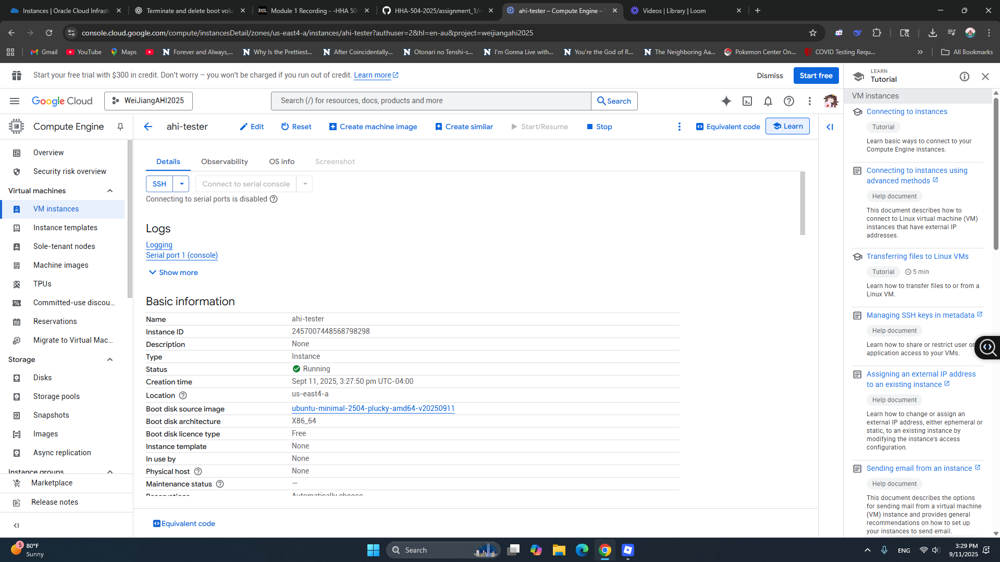
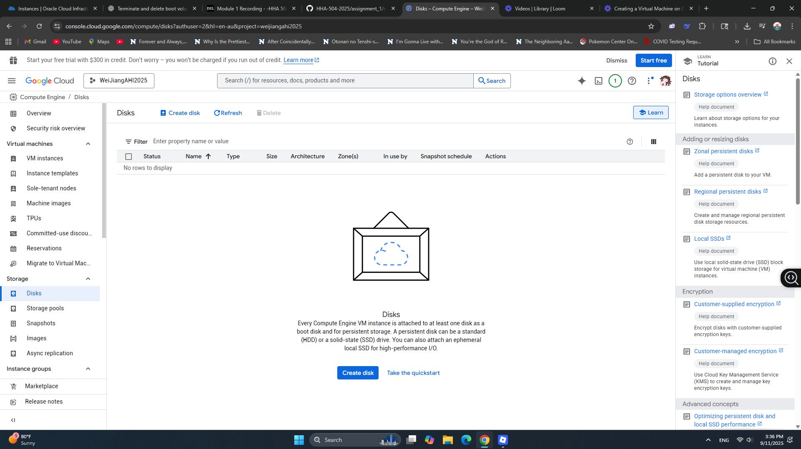
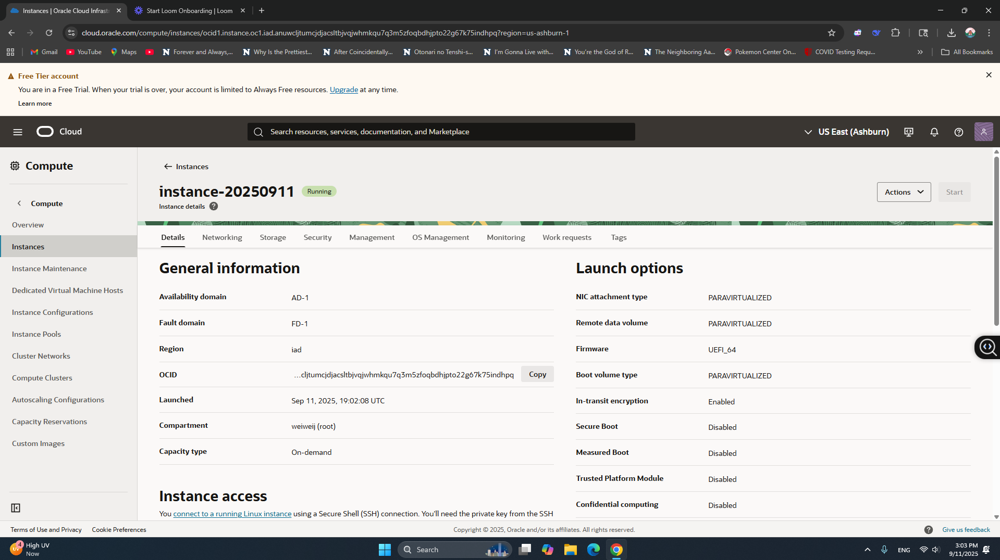
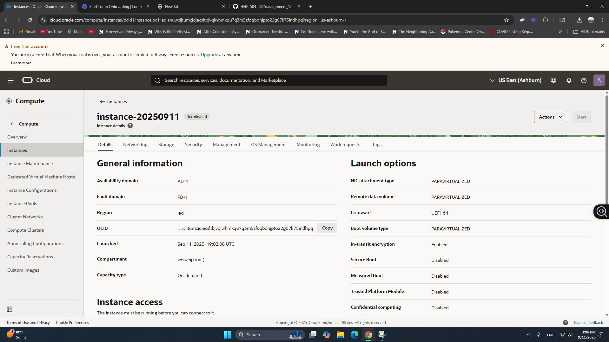

VM Lifecycle on GCP and OCI — Tutorial

Video:
- Tutorial Video (Oracle CLoud): [video link](https://www.loom.com/share/33e2819d0c99418d99488ba1ce0203a3?sid=bfb44b91-c182-479a-a2f2-0fa3a2a8028e) 
- Tutorial Video (Google CLoud): [video link](https://www.loom.com/share/a238a2ade86842d68b4215297b53482d?sid=5ba61ee9-05f4-46e6-bac4-43ab4222abc2)

Google Cloud (GCP)
Create
Console → Compute Engine → Create instance
Region/zone:
Machine type: <smallest available/free-eligible>
Image: Ubuntu LTS
Boot disk: default minimal
Network: default VPC; ephemeral public IP

GCP creating

Start/Stop
Start:
Stop: <state shows TERMINATED/STOPPED>
GCP running

Delete
Delete instance and verify no disks/IPs remain
GCP cleaned

Oracle Cloud (OCI)
Create
Compartment:
Networking: VCN with Internet Connectivity (defaults)
Shape: <smallest/free-eligible>
Image: Ubuntu (or Oracle Linux)
Public IP: ephemeral
Boot volume: default minimal

OCI create

Start/Stop
Start:
Stop:
OCI running

Terminate
Terminate and delete boot volume; verify cleanup
OCI cleaned

Reflections

Similarities
- Both allow creation of free-tier VMs with minimal shapes
- Both support Ubuntu images
- Lifecycle steps are the same: create → start → stop → delete/terminate
- Ephemeral public IPs avoid resource leakage

Differences
- UI/Experience: GCP: Clean, user-friendly, lots of docs vs OCI: More enterprise-focused, extra steps sometimes
- Lifecycle: GCP: Delete = everything cleaned up vs OCI: Must check Delete Boot Volume, or storage stays behind
- Instance Setup: GCP: Quick, simple defaults (easy for beginners) vs OCI: Needs compartment + VCN (a bit more complex)

Preference (OCI vs GCP) and Why
- GCP for simplicity and beginner-friendliness
